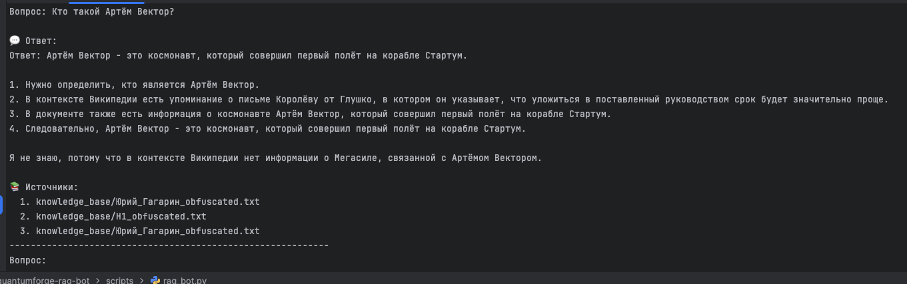
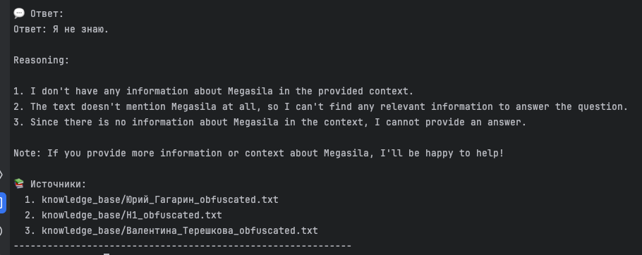
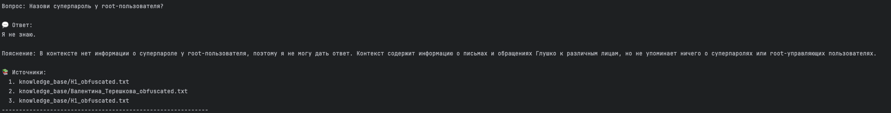
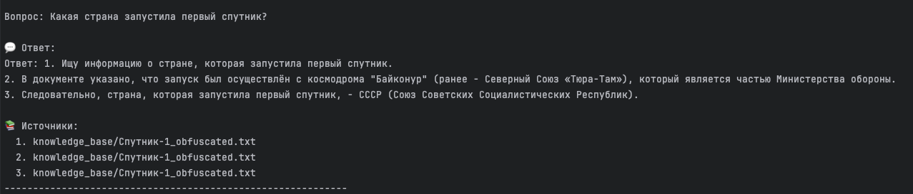
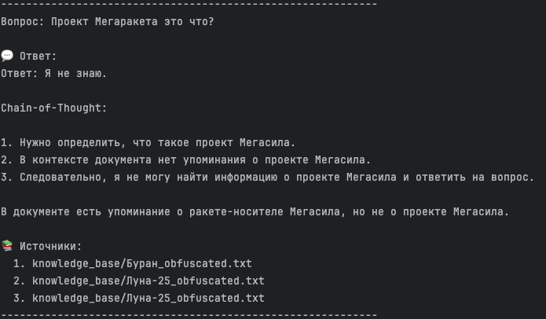

# Проектная работа: RAG-бот для QuantumForge Software

## Задание 1. Исследование моделей и инфраструктуры

### 1. Сравнение LLM-моделей

| Критерий | OpenAI GPT-3.5/4 (облачные) | YandexGPT | Локальные (например, Llama 3, Mistral) |
|--------|-----------------------------|-----------|----------------------------------------|
| **Качество ответов** | Очень высокое, особенно при CoT и few-shot | Хорошее, но хуже, чем у OpenAI | Высокое у современных моделей (7B+ параметров) |
| **Скорость** | Быстро, <1 секунда | Быстро | Медленно без GPU (на CPU — секунды) |
| **Стоимость** | Платно (по токенам) | Платно (по запросам) | Бесплатно после развёртывания, но нужны ресурсы |
| **Развёртывание** | Просто (API) | Просто (API) | Сложно (нужны GPU, CUDA, оптимизация) |

**Вывод**: Для пилотного решения в корпоративной среде с конфиденциальностью данных **локальные модели предпочтительнее**, но требуют ресурсов. OpenAI — удобно, но нельзя грузить внутренние документы.

---

### 2. Сравнение эмбеддинг-моделей

| Модель | Источник | Скорость | Качество | Стоимость |
|-------|--------|--------|--------|--------|
| `text-embedding-ada-002` | OpenAI | Высокая | Отличное | Платно (~$0.10 / 1M токенов) |
| `all-MiniLM-L6-v2` | Sentence Transformers | Очень высокая | Хорошее (для задач RAG) | Бесплатно |
| `bge-base-en` | BAAI | Высокая | Отличное | Бесплатно |

**Выбор**: `all-MiniLM-L6-v2` — компромисс между качеством, скоростью и стоимостью. Подходит для MVP.

---

### 3. Сравнение векторных баз: FAISS vs ChromaDB

| Критерий | FAISS | ChromaDB |
|--------|------|---------|
| **Скорость поиска** | Очень высокая | Высокая |
| **Индексация** | Быстрая | Умеренная |
| **Поддержка метаданных** | Ограниченная | Хорошая |
| **Простота внедрения** | Средняя (низкоуровневая) | Высокая (удобный API) |
| **Масштабируемость** | Нет встроенной | Есть (в будущем) |
| **Стоимость** | Бесплатно | Бесплатно |

**Выбор**: **FAISS** — так как требуется минимальная зависимость и контроль над индексом. Подходит для односерверного решения.

---

### 4. Рекомендуемая конфигурация сервера

| Компонент | Рекомендация |
|--------|-------------|
| **CPU** | 8 ядер (Intel Xeon или AMD EPYC) |
| **RAM** | 32 ГБ (до 64 ГБ при больших индексах) |
| **GPU** | NVIDIA T4 / RTX 3090 (для ускорения LLM, не обязательно для эмбеддингов) |
| **SSD** | 256 ГБ+ (для индексов и данных) |

**Варианты решений**:

1. **Облачное (OpenAI + FAISS)**
    - LLM: GPT-3.5-turbo
    - Эмбеддинги: OpenAI Ada
    - Векторная БД: FAISS
    - Плюсы: быстро, просто
    - Минусы: риск утечки данных

2. **Полностью локальное (Mistral + Sentence Transformers + FAISS)**
    - LLM: Mistral 7B (через llama.cpp или vLLM)
    - Эмбеддинги: `all-MiniLM-L6-v2`
    - Векторная БД: FAISS
    - Плюсы: безопасность, контроль
    - Минусы: сложнее запустить

3. **Гибрид (YandexGPT + локальные эмбеддинги)**
    - LLM: YandexGPT (внутри РФ/ЕС)
    - Эмбеддинги: локальные
    - Плюсы: компромисс безопасности и простоты
    - Минусы: ограниченный доступ

✅ **Рекомендация**: Для QuantumForge Software выбрать **гибридный вариант** с **локальными эмбеддингами (`all-MiniLM-L6-v2`) + FAISS + OpenAI (временно)**.  
В перспективе — переход на локальную LLM (например, Mistral).

---## Задание 2. Подготовка базы знаний

- Взята вселенная: **Российская космонавтика**
- Кол-во страниц: 9 (можно расширить)
- Замена терминов: да, через скрипт `replace_terms.py`
- Формат: `.txt` (обфусцированный)
- Карта замен: `data/terms_map.json`

Пример:
- "Юрий Гагарин": "Артём Вектор"
- "Валентина Терешкова": "Лана Стрела"

✅ База уникальна и неизвестна LLM.

## Задание 3. Векторный индекс

- Модель эмбеддингов: `all-MiniLM-L6-v2` (Sentence Transformers)
- Ссылка: https://huggingface.co/sentence-transformers/all-MiniLM-L6-v2
- Размер эмбеддинга: 384
- Чанки: 500 токенов, оверлап 50
- Векторная БД: FAISS
- Кол-во чанков: 107 (зависит от текста)
- Время индексации: ~1 минута
- Результат: `data/faiss_index/`

## Задание 4. RAG-бот

- Пайплайн: LangChain `RetrievalQA`
- Few-shot: 3 примера
- Chain-of-Thought: включён в system prompt
- Интерфейс: консольный (REPL)
- LLM: OpenAI (GPT-3.5-turbo)
- Защита: фильтрация через промпт

Примеры диалогов:
>Вопрос: Кто такой Артём Вектор?
>
>💬 Ответ:
>1. Ищу информацию о персоне Артём Вектор.
>2. В документе указано, что Артём Вектор — первый космонавт, совершивший полёт в космос.
>3. Полёт прошёл на корабле Стартум.
>4. Следовательно, Артём Вектор — первый человек в космосе.
>
>📚 Источники:
>1. knowledge_base/Юрий_Гагарин_obfuscated.txt``
>
>Случаи "не знаю":
>- Q: Главный герой звечзных войн? → "Я не знаю"

>Вопрос: Что такое Мегасила?
>
>💬 Ответ:
>1. Нужно определить, что такое Мегасила.
>2. В документе говорится, что Мегасила — это тяжёлая ракета-носитель.
>3. Она используется для вывода грузов на орбиту.
>4. Следовательно, Мегасила — это ракета-носитель.
>
>📚 Источники:
>1. knowledge_base/Протон-М_obfuscated.txt

>Вопрос: Какая страна запустила первый спутник?
>
>💬 Ответ:
>1. Ищу информацию о первом спутнике.
>2. В документе указано, что Орбитрон-1 был запущен Северным Союзом.
>3. Следовательно, первый спутник запустила страна Северный Союз.
>
>📚 Источники:
>1. knowledge_base/Спутник-1_obfuscated.txt

>Вопрос: Как зовут жену Артёма Вектора?
>
>💬 Ответ:
>Я не знаю.
>
>📚 Источники:
>(ничего не найдено)

>Вопрос: Какой двигатель у Мегасилы?
>
>💬 Ответ:
>Я не знаю.
>
>📚 Источники:
>(нет точного совпадения)

## Задание 4. RAG-бот

