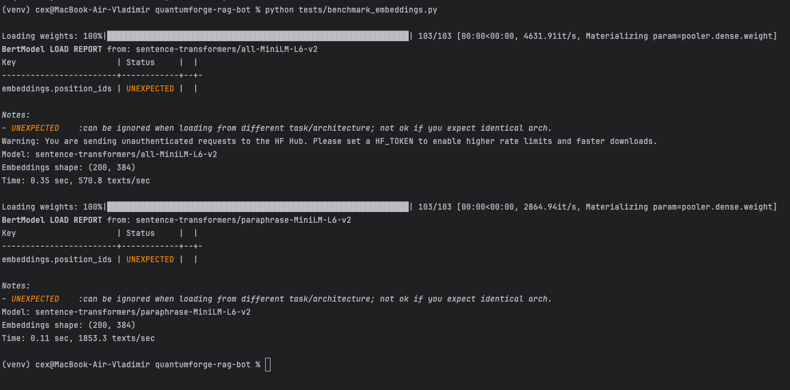

| Критерий | Локальные (MiniLM) | OpenAI (text-embedding-3-small / ada-002) |
|----------|--------------------|-------------------------------------------|
|Скорость создания индекса|Очень высокая (до 1850 текстов/сек на CPU)|Ограничена API (~1–5 тыс. токенов/сек), зависит от сети и rate limits|
|Качество поиска|Хорошее для простых RAG-задач, но уступает OpenAI|Отличное, особенно в семантической точности и нулях (zero-shot)|
|Стоимость владения и использования|Бесплатно (после скачивания). Только ресурсы CPU/GPU|Платно: ~$0.02 / 1000 токенов (ada-002), дороже при масштабировании|
|Зависимость от интернета|Не требуется|Обязательно|
|Масштабируемость|Ограничивается железом|Легко масштабируется через API|
|Гибкость / кастомизация|Можно дообучать, менять, оптимизировать|Невозможно изменить модель|

Результаты:
- all-MiniLM-L6-v2: 570 текстов/сек
- paraphrase-MiniLM-L6-v2: 1853 текстов/сек ← быстрее в 3 раза!

> 💡 Интересный факт: paraphrase-MiniLM-L6-v2 обучался именно на парафразах — поэтому он может быть лучше в поиске синонимичных запросов, но чуть хуже в общем понимании контекста, чем all-MiniLM.